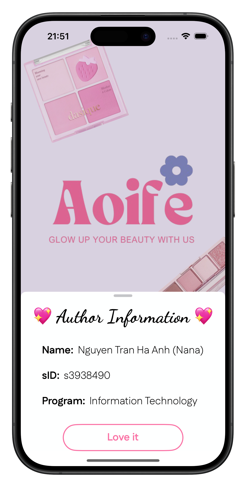

# Aoife - Glow Up Your Beauty With Us 🎀

## 💄 Description

- This is an application that recommends cosmetics products for various colour schemes in order to improve the user's natural appearance
- The primary objective of this application is to assist females who are experiencing difficulty in selecting cosmetics products that are appropriate for their skin tone and colour
- support them in identifying the most suitable products to enhance their natural appearance

<!--
-->
<!--   -->
<!--   -->
<!--   -->
<!--  -->
<!--
-->

Note: there is another branch "no-map" which is the simplifed version of the contact list contains no map feature for people who are not interested in the map feature.

## 🔮 Live Demo (Animation GIF)

<table>
  <tr>
     <td>Map with Welcome Page</td>
     <td>Map without Wecome Page</td>
     <td>No Map without Wecome Page</td>
  </tr>
  <tr>
    <td></td>
    <td></td>
    <td></td>
   </tr>

 </table>

## 🔧 Build Information
- Xcode 13.4.1
- SwiftUI Framework
- Target Deployment iOS >=15.5
- Library: CoreLocation for the MapKit

## 🏆 Author
- Huynh Nguyen Minh Thong (Tom Huynh) - tomhuynhsg@gmail.com
