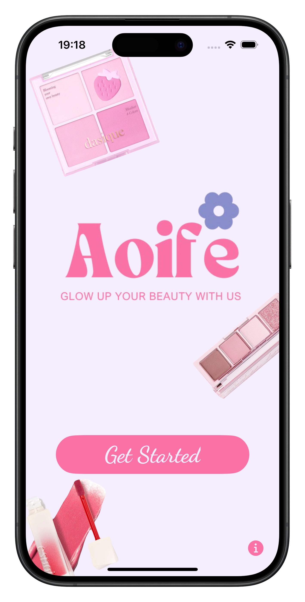
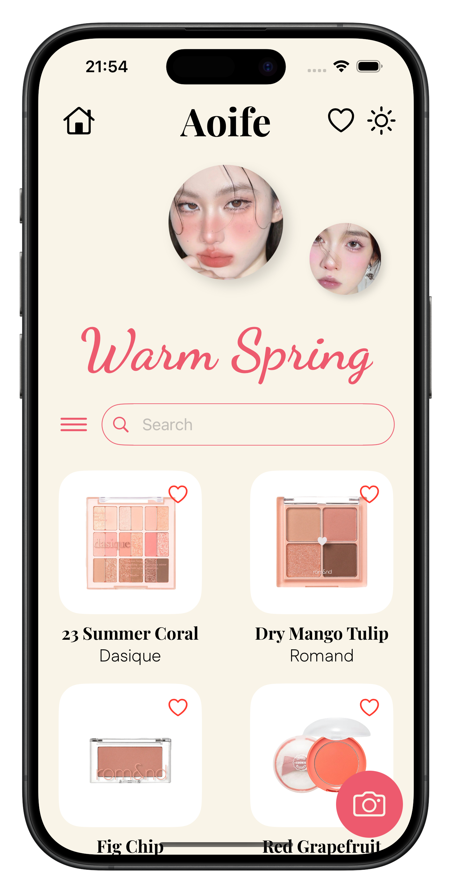
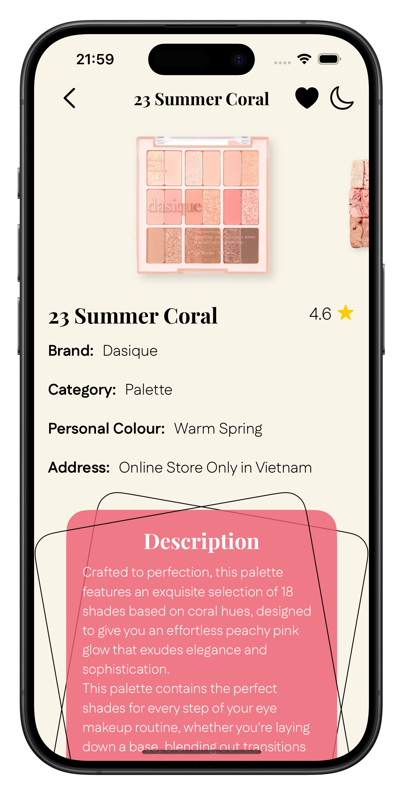
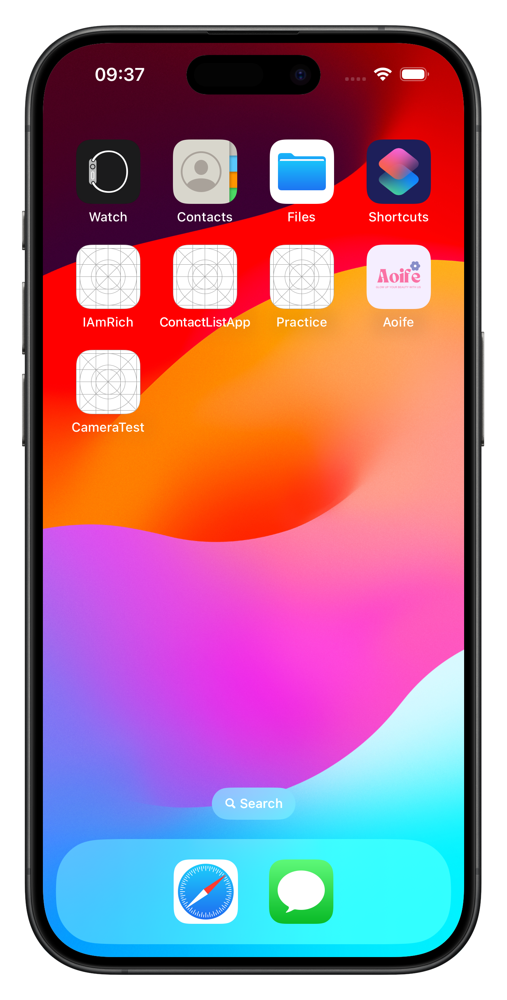

# Aoife - Glow Up Your Beauty With Us 🎀

## 💄 Description

- This is an application that recommends cosmetics products for various colour schemes in order to improve the user's natural appearance
- The primary objective of this application is to assist females who are experiencing difficulty in selecting cosmetics products that are appropriate for their skin tone and colour
- support them in identifying the most suitable products to enhance their natural appearance

   
   
   
  

## 💖 Live Demo (Youtube Video)

<table>
  <tr>
     <td>Simulator</td>
     <td>Device</td>
  </tr>
  <tr>
    <td></td>
        <td></td>
   </tr>

 </table>

## 🔧 Build Information
- Xcode 13.4.1
- SwiftUI Framework
- Target Deployment iOS >=15.5
- Library: CoreLocation for the MapKit

## 🏆 Author
- Huynh Nguyen Minh Thong (Tom Huynh) - tomhuynhsg@gmail.com
